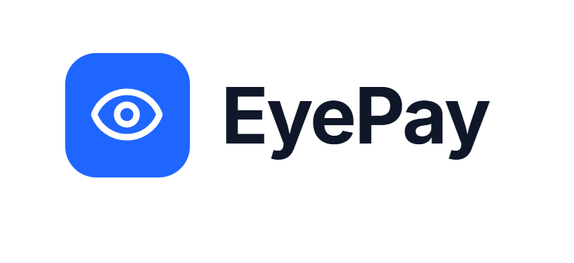

<p align="center">
  
</p>

<h1 align="center">💸 EyePay</h1>

<p align="center">
  <strong>AI-Powered Global Remittance & Digital Payments Platform</strong>
</p>

<p align="center">
  Secure • Intelligent • Global
</p>

<p align="center">
  
  
  
  
  
  
  
</p>

<p align="center">
  <a href="https://eye-pay-eyepay.vercel.app">
    🌐 Live Demo
  </a>
  •
  <a href="https://eyepay-1.onrender.com">
    ⚡ API
  </a>
</p>

---

#  Overview

EyePay is a modern fintech platform built for secure global remittances, digital wallet management, fraud detection, and intelligent financial insights.

The platform enables users to manage wallets, send money internationally, monitor transactions, detect suspicious activity, and analyze financial behavior through interactive dashboards.

Built with a production-ready architecture using React, Express, PostgreSQL, Neon, Render, and Vercel.

---

#  Features

| Feature | Description |
|----------|-------------|
| 🔐 Authentication | Secure JWT-based login and registration |
| 💰 Wallet Management | Deposit, withdraw, and track balances |
| 👥 Recipient Management | Manage recipients for global transfers |
| 🌍 Global Transfers | International remittance workflows |
| 📄 Transaction History | Complete transaction records |
| 🛡️ Fraud Detection | Risk scoring and suspicious activity detection |
| 📊 Analytics Dashboard | Financial insights and transaction analytics |
| 🧠 Intelligence Dashboard | AI-driven recommendations and monitoring |
| ☁️ Cloud Deployment | Production deployment on Vercel & Render |

---

# 🏗️ System Architecture

```text
┌─────────────────────────────┐
│      React + Vite UI        │
└──────────────┬──────────────┘
               │
               ▼
┌─────────────────────────────┐
│     Node.js + Express API   │
└──────────────┬──────────────┘
               │
               ▼
┌─────────────────────────────┐
│   PostgreSQL Database       │
│          (Neon)             │
└──────────────┬──────────────┘
               │
               ▼
┌─────────────────────────────┐
│ Fraud Detection & Analytics │
└─────────────────────────────┘
```

---

#  Product Preview

<p align="center">
  
</p>

---

#  Tech Stack

## Frontend

<p>
  
  
  
  
</p>

### Technologies

- React
- TypeScript
- Vite
- Tailwind CSS
- React Router

---

## Backend

<p>
  
  
  
</p>

### Technologies

- Node.js
- Express
- JWT Authentication
- REST APIs

---

## Database

<p>
  
  
  
</p>

### Technologies

- PostgreSQL
- Drizzle ORM
- Neon Database

---

# ☁️ Deployment

| Component | Platform |
|------------|-----------|
| Frontend | Vercel |
| Backend | Render |
| Database | Neon |
| Version Control | GitHub |

---

# 📁 Project Structure

```text
EyePay
│
├── artifacts
│   ├── eyepay
│   │   ├── src
│   │   └── public
│   │
│   └── api-server
│       ├── src
│       └── routes
│
├── lib
│   ├── db
│   ├── api-spec
│   └── api-zod
│
├── docs
│   ├── banner
│   └── screenshots
│
├── package.json
└── README.md
```

---

# ⚙️ Local Development

## Clone Repository

```bash
git clone https://github.com/prvsh77/EyePay.git

cd EyePay
```

## Install Dependencies

```bash
pnpm install
```

## Configure Environment Variables

Create a `.env` file:

```env
DATABASE_URL=your_database_url
JWT_SECRET=your_secret_key
PORT=5000
NODE_ENV=development
```

---

## Start Backend

```bash
pnpm --filter @workspace/api-server run dev
```

---

## Start Frontend

```bash
pnpm --filter @workspace/eyepay run dev
```

---

# 🎯 Roadmap

## Version 1.0 ✅

- [x] User Authentication
- [x] Wallet Management
- [x] Recipient Management
- [x] Global Transfers
- [x] Fraud Detection
- [x] Analytics Dashboard
- [x] Intelligence Dashboard
- [x] Production Deployment

## Version 2.0 🚧

- [ ] AI Financial Copilot
- [ ] KYC Verification
- [ ] Multi-Currency Wallets
- [ ] Email Notifications
- [ ] Crypto Payments
- [ ] Mobile Application
- [ ] Advanced Fraud Analytics

---

# 📊 Project Status

🟢 Active Development

EyePay is currently deployed and running in production with a fully functional frontend, backend, and cloud database infrastructure.

---

# 👨‍💻 Author

### M Prashant Rao

Computer Science Student • AI Engineer • Full-Stack Developer

GitHub:
https://github.com/prvsh77

---

#  Support

If you found this project useful, consider giving it a star.

Star ⭐ the repository and follow for future updates.

---

# 📜 License

MIT License
